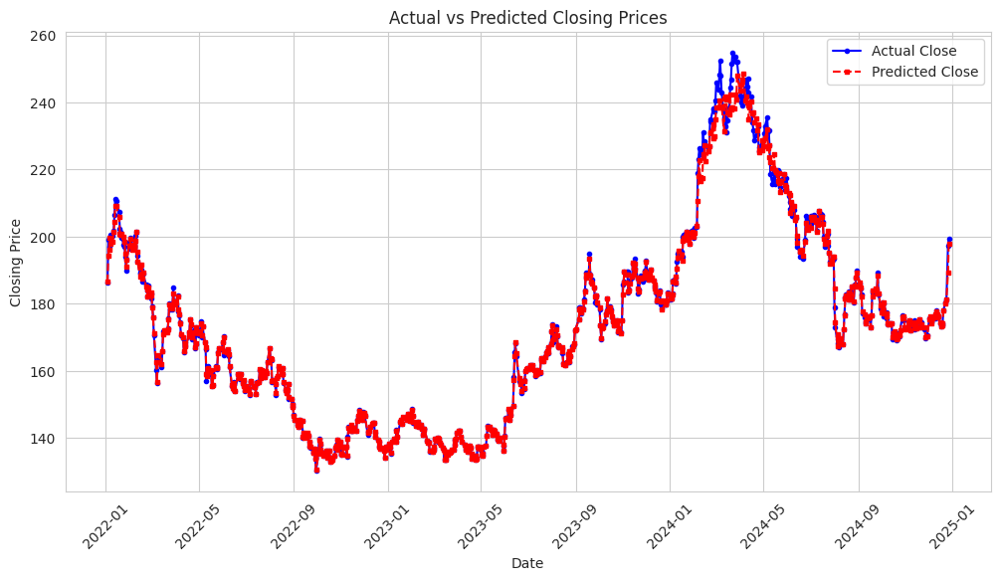

# Stock Price Prediction Using Boosted Hybrid Model

## Project Overview

This project focuses on stock price prediction using a **Boosted Hybrid Model**, which combines a **Sinusoidal Regressor** with an **XGBoost model**. The hybrid approach effectively captures both **cyclical patterns** and **non-linear residual dependencies**, leading to **significant performance improvements** over traditional models such as **LSTM** and **ensemble methods**.

## Key Findings

1. **Boosted Hybrid Model Achieves the Best Performance:**

   - **RMSE:** **2.0516** (lowest among tested models)
   - **MAE:** **0.8400** (significantly reduced error)
   - **MSE:** **4.2090** (captures trends effectively)
   - **MAPE:** **0.3973** (high accuracy in percentage terms)
   - **R² Score:** **0.9950** (explains 99.5% of the variance in stock prices)

     
2. **Comparison with Other Models:**

   - **LSTM Model:** Captured sequential patterns well but struggled with long-term dependencies and had **higher RMSE and MAE**.
   - **Ensemble of LightGBM + LSTM:** Introduced excessive variance, leading to performance degradation instead of improvement.
3. **Insights from EDA:**

   - **Time Period:** The dataset spans from **March 17, 1980, to December 27, 2024**.
   - **Stationarity:** The **Augmented Dickey-Fuller (ADF) test** confirmed that the **Close Price series is non-stationary**, requiring transformations before modeling.
   - **Trend Analysis:** Long-term price growth observed, punctuated by significant corrections around **2000, 2008, and 2020**, coinciding with economic downturns.
   - **Seasonality Analysis:** Small seasonal fluctuations detected, though **not strong enough for a pure seasonal model**.
   - **Volatility & Risk:** The **daily returns histogram** revealed a **high peak at zero (low-activity days)** and **fat tails**, indicating **occasional extreme price swings**.
   - **Autocorrelation Analysis:** Showed that past stock prices **strongly influence future prices**, justifying the use of **time-dependent models**.
   - **Anomaly Detection:** Using **Z-score analysis**, significant outliers were detected, mostly in recent years, correlating with major market events.

## Model Architectures

### **1. Sinusoidal Regressor (First Stage)**

- Captures **periodic trends** using **sine and cosine transformations**.
- Uses a **linear regression model** on transformed features to approximate stock price movements.
- Helps in modeling the inherent **cyclical nature of financial markets** (e.g., seasonal effects, economic cycles).
- Output: **Baseline stock price prediction**, removing primary cyclical fluctuations.

### **2. XGBoost Model (Second Stage)**

- Learns the **residual errors** from the Sinusoidal Regressor.
- **Boosting approach** ensures that errors are iteratively minimized, improving prediction accuracy.
- Handles **non-linear dependencies and complex patterns** in stock price fluctuations.
- **Hyperparameters:**
  - Number of estimators: **500**
  - Learning rate: **0.01**
  - Max depth: **7**
  - Regularization: Applied to prevent overfitting.
- Output: **Final stock price prediction** that accounts for non-cyclical patterns and irregular fluctuations.

## Reproducing the Results

### **1. Setting Up the Environment**

Ensure you have the required Python libraries installed:

```bash
pip install numpy pandas scikit-learn xgboost lightgbm matplotlib seaborn
```

### **2. Running the Code**

#### **If using Kaggle Notebooks:** Run from the **first cell**.

#### **If using a local machine:** Run from the **second cell** and replace the path to the dataset correctly.

```python
# Load dataset
import pandas as pd

df = pd.read_csv("path/to/your/dataset.csv")  # Update the path if running locally
```

### **3. Training the Model**

Execute the script to:

- Preprocess the data (handle missing values, create lag features, normalize data).
- Train the **Boosted Hybrid Model** (Sinusoidal Regressor + XGBoost).
- Evaluate performance using **RMSE, MAE, MAPE, and R² Score**.

### **4. Model Evaluation**

- Run performance metrics to compare predictions against actual values.

## Limitations & Future Work

- **Computational Cost:** The hybrid model requires **more processing power** than traditional models.
- **Feature Sensitivity:** Model performance can vary based on the **choice of lag features** and **sinusoidal frequencies**.
- **Potential Overfitting:** While **R² is high**, additional testing is required to ensure generalization.

### **Possible Improvements:**

- **Hyperparameter tuning** using **Bayesian Optimization** to refine model parameters.
- **Feature Engineering Enhancements:** Incorporating **macroeconomic indicators, sentiment analysis, and financial ratios**.
- **Alternative Hybrid Models:** Exploring **CatBoost**, **LightGBM-based hybrids**, or **attention-based deep learning models**.
- **Longer Training Periods:** Extending historical data usage to **better capture broader market trends**.

## Conclusion

The **Boosted Hybrid Model** (Sinusoidal Regressor + XGBoost) demonstrated **exceptional predictive performance**, outperforming LSTM and ensemble models. This approach successfully integrates **cyclical trend modeling with non-linear boosting techniques**, making it a **robust solution for stock price forecasting**. With further refinements, this methodology can be enhanced for even **greater accuracy and generalizability**.
